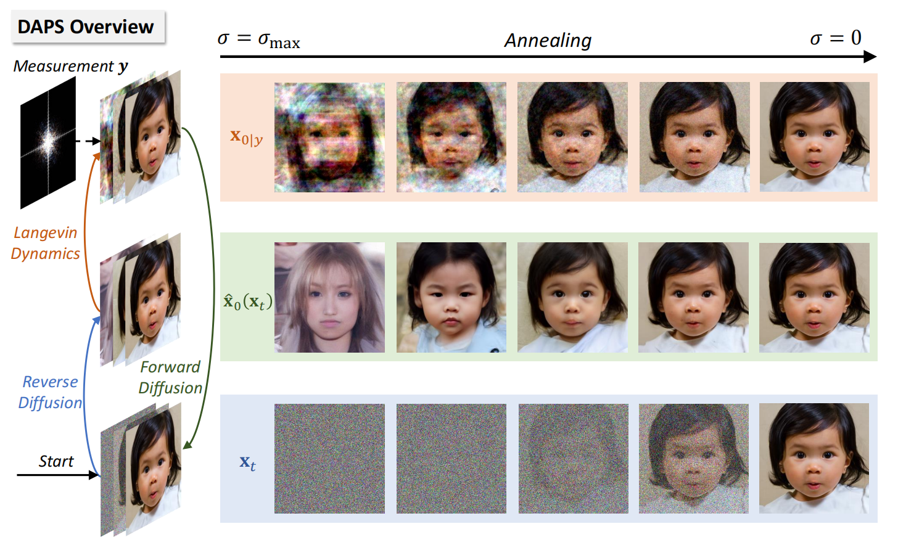

# Decoupled Annealing Posterior Sampling

#### [website](https://daps-inverse-problem.github.io/) |  [paper](https://arxiv.org/abs/2407.01521)


## Abstract

We propose a new method called Decoupled Annealing Posterior Sampling (DAPS) that relies on a novel noise annealing process to solve posterior sampling with diffusion prior. Specifically, we decouple consecutive steps in a diffusion sampling trajectory, allowing them to vary considerably from one another while ensuring their time-marginals anneal to the true posterior as we reduce noise levels. 



Our approach enables the exploration of a larger solution space, improving the success rate for accurate reconstructions. We demonstrate that DAPS significantly improves sample quality and stability across multiple image restoration tasks, particularly in complicated nonlinear inverse problems. For example, we achieve a PSNR of **30.72**dB on the FFHQ 256 dataset for phase retrieval, which is an improvement of **9.12**dB compared to existing methods.


## Getting started

#### 1. Prepare the Conda environment

```
# in DAPS folder

conda create -n DAPS python=3.8
conda activate DAPS

pip install -r requirements.txt
```

We use [bkse](https://github.com/VinAIResearch/blur-kernel-space-exploring) for nonlinear blurring and [motionblur](https://github.com/LeviBorodenko/motionblur) for motion blur. **No further action required then**.


#### 2. Prepare the pretrainedcheckpoint

Download the public available FFHQ checkpoint (ffhq_10m.pt) [here](https://drive.google.com/drive/folders/1jElnRoFv7b31fG0v6pTSQkelbSX3xGZh).

```
# in DAPS folder

mkdir checkpoint
mv {DOWNLOAD_DIR}/ffqh_10m.pt checkpoint/ffhq256.pt
```


**(Optional)** For nonlinear deblur task, we need the pretrained model from [bkse](https://github.com/VinAIResearch/blur-kernel-space-exploring) at [here](https://drive.google.com/file/d/1vRoDpIsrTRYZKsOMPNbPcMtFDpCT6Foy/view?usp=drive_link):

```
# in DAPS folder

mv {DOWNLOAD_DIR}/GOPRO_wVAE.pth forward_operator/bkse/experiments/pretrained
```


#### 3.  (Optional) Prepare the dataset (or use provided examples)

You can add any FFHQ256 images you like to `dataset/demo` folder


#### 4. Sample

Make a folder to save results:

```
mkdir results
```

##### Phase Retrieval

Now you are ready for run. For **phase retrieval** with DAPS-1k in 4 runs for $10$ demo images in `dataset/demo`:

```
python posterior_sample.py \
+data=demo \
+model=ffhq256ddpm \
+task=phase_retrieval \
+sampler=edm_daps \
save_dir=results \
num_runs=4 \
sampler.diffusion_scheduler_config.num_steps=5 \
sampler.annealing_scheduler_config.num_steps=200 \
batch_size=10 \
data.start_id=0 data.end_id=10 \
name=phase_retrieval_demo \
gpu=0
```

It takes about $8$ minutes ($2$ for each run) and $6G$ GPU memory on a single NVIDIA A100-SXM4-80GB GPU. The results are saved at foloder `\results`. 


##### All Tasks

```
python posterior_sample.py \
+data=demo \
+model=ffhq256ddpm \
+task={TASK_NAME} \
+sampler=edm_daps \
save_dir=results \
num_runs=4 \
sampler.diffusion_scheduler_config.num_steps=5 \
sampler.annealing_scheduler_config.num_steps=200 \
batch_size=10 \
data.start_id=0 data.end_id=10 \
name={SUB_FOLDER_NAME} \
gpu=0
```

replace the {TASK_NAME} by one of following:

* `phase_retrieval`: phase retrival of oversample ratio of $2.0$

* `down_sampling`: super resolution ($\times 4$)
* `inpainting`:  128x128 box inpainting
* `inpainting_rand`: $70\%$ random inpainting 

* `gaussian_blur`: gaussian deblur of kernel size $61$ and intensity $3$
* `motion_blur`: gaussian deblur of kernel size $61$ and intensity $0.5$

* `nonlinear_blur`: nonlinear deblur of default setting in bkse repo
* `hdr`: high dynamic range reconstruction of factor $2$ 


## Citation

If you find our work interesting, please consider citing

```
@misc{zhang2024improvingdiffusioninverseproblem,
      title={Improving Diffusion Inverse Problem Solving with Decoupled Noise Annealing}, 
      author={Bingliang Zhang and Wenda Chu and Julius Berner and Chenlin Meng and Anima Anandkumar and Yang Song},
      year={2024},
      eprint={2407.01521},
      archivePrefix={arXiv},
      primaryClass={cs.LG},
      url={https://arxiv.org/abs/2407.01521}, 
}
```
